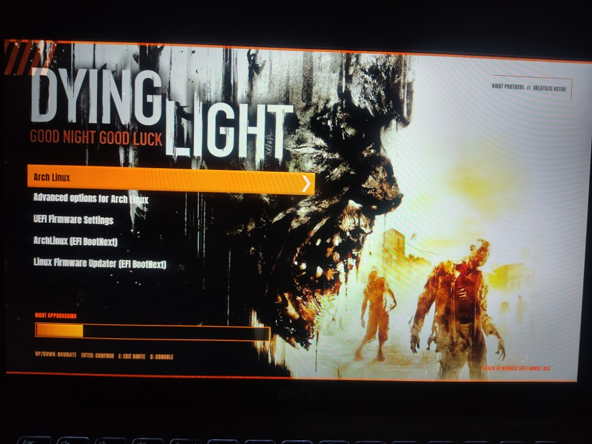

# Dying Light GRUB Theme

A cinematic **Dying Light-inspired GRUB theme** for Linux, featuring the iconic dark survival aesthetic with orange/amber UI elements.



## Features

- Dying Light-inspired dark cinematic background
- Orange/amber selected menu item
- Custom Anton-style typography
- Custom navigation arrow
- Clean and minimal GRUB menu layout
- Dying Light-style HUD text and labels
- Countdown/progress bar matching the theme
- 1920×1080 optimized layout
- Custom GRUB UI assets and borders
- Works with UEFI GRUB setups

## Installation

### 1. Clone the repository

```bash
git clone https://github.com/DarshilNaliyapara/dying_light_grub_theme.git
cd dying_light_grub_theme
```

### 2. Run the installer

```bash
sudo ./install.sh
```

The installer will copy the theme, configure GRUB, and regenerate the GRUB configuration.

### 3. Reboot

```bash
sudo reboot
```

After reboot, the Dying Light theme should appear as your GRUB boot menu.

## Requirements

- GRUB 2
- Linux system using GRUB
- UEFI recommended
- 1920×1080 display recommended

## Customization

The main theme configuration can be modified through `theme.txt`.

You can adjust:

- Menu position
- Font size
- Menu spacing
- Colors
- Selection bar
- Countdown/progress bar
- HUD elements

## Credits

Inspired by the visual style of **Dying Light** by Techland.

**Anton** font is used for the theme typography and is distributed under the SIL Open Font License.

This is a fan-made GRUB customization and is not affiliated with or endorsed by Techland.

---

<div align="center">

**GOOD NIGHT. GOOD LUCK.**

</div>
